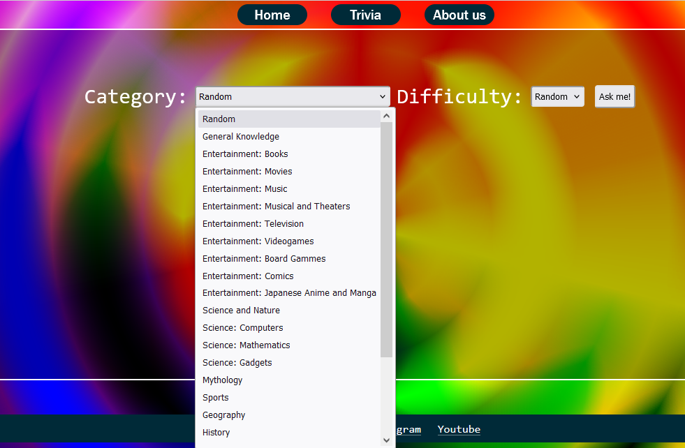

# USER MANUAL

# Introduction
Welcome to the Trivia API, a final studies project from Josep, Kai, Jordi and Mateu. We are students of programming and QA and with this project we have created a functional API and tested it, accomplishing all the parts of a successful programming project.  

Trivia API works access to Open Trivia DB, an open project from the community to the community that contains over 11.000 questions and answers. It’s meant to be used to students like us to do projects and learn how to code, design, and collaborate all together. 

In our page you can access to three different pages, HOME, TRIVIA and ABOUT US. Now we are going to learn how to use the page and the different parts of it. 

# Requirements
The page supports the main browsers, namely Google Chrome, Mozilla Firefox, Microsoft Edge and Safari. As the page is hosted in the Github servers, it doesn’t need any specific requirements from the user, only an up to date browser. 

# How to use
To use Trivia API access the page with your browser. You will access the main page, and you’ll be able to navigate to the following:

## HOME page
In the main page you will find the presentation and you’ll be able to access through the navigation bar to the other pages, namely TRIVIA and ABOUT US.

## TRIVIA
In the most important page of the project you can find the trivia questions generator. 

### Categories 
By clicking in the Category drop-down you will find 24 different categories and a Random option. Use this to choose a particular topic for you question or keep in Random to have them all.

### Difficulty
By clicking in the Difficulty drop-down you can find the 3 difficulties: easy, medium and hard. Also there is again the Random option to get all the types of questions. The questions are made by the community, so the question, the answer and the assigned difficulty is up to the original creator. 

### Ask me!
By clicking Ask me! you will receive a 4 option question of the category and the difficulty chosen. By default this choices will be randomized.

### Answer the question
Once the question has appeared there will be one correct answer and three incorrect ones. By clicking one of the answers your choice will be checked and text will appear indicating if its right or wrong. 

### Error message
If the Ask me! button is clicked many times in a short period of times an error message will appear, indicating that the page hasn’t had time to access the Database and ask you to wait a few seconds. By doing it, you will be able to ask for a new question again. 

## ABOUT US
In this page you will find the basic presentation about us, our project, and how it works and what you can do.

# Possible bugs, errors and fixes
As mentioned before, by clicking the Ask me! button on the Trivia page to many times an error occurs because the page cannot receive a response from the API in time. Waiting the time as indicated impedes the error message to appear. 
Note also that the page is dependent of an external database that can down at any given time without a warning. Once the database is up again the Trivia questions can be accessed again. 

# Final considerations
The creators of this project thank you for using our page and playing with our Trivia game. Any bug report that you can provide is welcome and will help us in our project. 

Josep, Kai, Jordi, Mateu 
